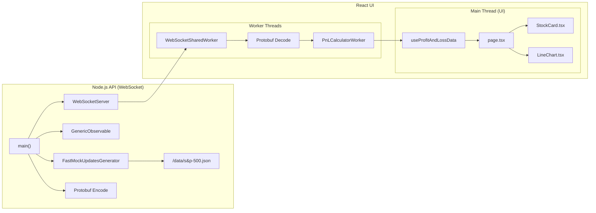

# react-rt-demo

This project demonstrates the techniques for building a high-performance, real-time dashboards using React, TypeScript, WebSockets, Protobuf.

Renders 200 positions from S&P 500 with price updates at 100Hz and >= 60fps.

[demo.webm](https://github.com/user-attachments/assets/50caea1b-9ed3-4619-b7ef-48976e31c412)

The architecture consists of the following main components:



## API

- **[`FastMockUpdatesGenerator`](api/src/mock-data-generator.ts)**: Generates high-frequency mock stock data updates using sine wave patterns for realistic price movements. Uses single-dimensional `BigInt64Array` for zero-copy operations. Implements delta processing - only queues stocks that have changed. Data format: `[stockIndex, last, change, changePercentage, high, low, volume]` repeated for each updated stock.

- **Protobuf Encoding/Decoding**: Efficiently encodes stock data in binary format (`Uint8Array<ArrayBufferLike>`) for WebSocket transmission. Uses two message types defined in [`demo.proto`](api/proto/demo.proto):
  
  - **`HeaderData`**: Sent once on connection. Contains static reference data:
    ```proto
    message HeaderData {
      repeated string symbols = 1;  // ["AAPL", "MSFT", ...]
      repeated string names = 2;    // ["Apple Inc", "Microsoft Corp", ...]
    }
    ```
  
  - **`PriceUpdates`**: Sent at 100Hz frequency. Contains delta updates using packed arrays:
    ```proto
    message PriceUpdates {
      repeated double data = 1 [packed=true];  // Flat array format for performance
    }
    ```
    Data format: `[stockIndex₀, last₀, change₀, changePercentage₀, high₀, low₀, volume₀, stockIndex₁, last₁, ...]` - 7 values per updated stock.

- **[`GenericObservable`](api/src/generic-observable.ts)**: Simple abstraction that separates data generation from WebSocket transmission logic using generator functions.

- **[`WebSocketServer`](api/src/web-socket.ts)**: Manages WebSocket connections and broadcasts encoded stock data. Sends `HeaderData` immediately on connection, then `PriceUpdates` at 100Hz using a heartbeat mechanism for connection health monitoring.

## UI Architecture

### Worker Thread Design

The UI uses two specialized workers for optimal performance:

#### 1. WebSocket Shared Worker ([`websocket-shared-worker.js`](ui/public/workers/websocket-shared-worker.js))
**Purpose**: Single WebSocket connection management across browser tabs
- Maintains one WebSocket connection shared across multiple tabs/windows
- Handles protobuf decoding in worker thread to prevent main thread blocking
- Broadcasts decoded messages to all connected ports
- **Communication Format**: 
  - Receives: Binary protobuf messages from server
  - Sends: Plain JavaScript objects to main thread
  ```javascript
  // Header message
  { type: "header", data: { symbols: [...], names: [...] } }
  
  // Update message  
  { type: "update", data: { data: [7,142.5,0.8,0.56,143.1,141.9,1250000,...], timestamp: 1699123456789 } }
  ```

**Raw Server Data (7 values per stock):**
```
[0, 142.50, 0.80, 0.56, 143.10, 141.90, 1250000, 15, 89.25, -1.20, -1.33, 89.50, 88.90, 890000, ...]
 │   │      │     │     │      │      │        │   │     │      │      │      │      │
 │   │      │     │     │      │      │        │   │     │      │      │      └─ volume
 │   │      │     │     │      │      │        │   │     │      │      │      └─ low
 │   │      │     │     │      │      │        │   │     │      │      └─ high  
 │   │      │     │     │      │      │        │   │     │      └─ changePercentage
 │   │      │     │     │      │      │        │   │     └─ change
 │   │      │     │     │      │      │        │   └─ last
 │   │      │     │     │      │      │        └─ stockIndex
 │   │      │     │     │      │      └─ volume
 │   │      │     │     │      └─ low
 │   │      │     │     └─ high
 │   │      │     └─ changePercentage  
 │   │      └─ change
 │   └─ last
 └─ stockIndex
```

#### 2. P&L Calculator Worker ([`pnl-calculator-worker.js`](ui/public/workers/pnl-calculator-worker.js))
**Purpose**: Position filtering, sorting, and P&L calculations
- **Delta Processing**: Only processes stocks where user has positions (filters ~500 stocks → ~200 positions)
- **P&L Calculations**: Computes unrealized P&L using: `(currentPrice - entryPrice) × quantity`
- **Smart Sorting**: Separates and sorts by P&L percentage (losses first, biggest losses at top; then profits, biggest profits at top)
- **Enhanced Data Format**: Transforms 7-value arrays to 9-value arrays:
  ```javascript
  // Input: [stockIndex, last, change, changePercentage, high, low, volume]
  // Output: [stockIndex, last, change, changePercentage, high, low, volume, unrealizedPL, unrealizedPLPercentage]
  ```
- **Aggregation**: Calculates portfolio-level metrics (total P&L, win/loss counts)

**Enhanced P&L Data (9 values per position):**
```
[0, 142.50, 0.80, 0.56, 143.10, 141.90, 1250000, 1875.00, 1.33, 15, 89.25, -1.20, -1.33, 89.50, 88.90, 890000, -450.00, -0.56, ...]
 │   │      │     │     │      │      │        │        │     
 │   │      │     │     │      │      │        │        └─ unrealizedPLPercentage
 │   │      │     │     │      │      │        └─ unrealizedPL
 │   │      │     │     │      │      └─ volume
 │   │      │     │     │      └─ low
 │   │      │     │     └─ high
 │   │      │     └─ changePercentage
 │   │      └─ change  
 │   └─ last
 └─ stockIndex
```

### Data Flow Communication Protocol

The system uses a deliberately non-human-friendly but performance-optimized flat array format:

1. **Server → WebSocket Worker**: Binary protobuf with packed double arrays
2. **WebSocket Worker → P&L Worker**: Raw numeric arrays (7 values per stock)
3. **P&L Worker → Main Thread**: Enhanced arrays (9 values per stock) + aggregates

This approach eliminates object creation/destruction overhead and enables zero-copy operations with `BigInt64Array`.

### Main Thread Components

- **[`useProfitAndLossData`](ui/hooks/use-profit-and-loss-data.ts)**: React hook managing worker communication. Implements subscriber pattern for data distribution and handles worker lifecycle management.

- **[`page.tsx`](ui/app/page.tsx)**: Main dashboard component. Processes flat arrays directly in render loop without object allocation. Uses `React.memo()` and stable references to prevent unnecessary re-renders.

- **[`StockCard.tsx`](ui/components/stock-card.tsx)**: Individual stock position component. Optimized with granular prop dependencies and inline styles to avoid CSS recalculation overhead.

- **Virtual Scrolling**: Renders only visible rows (~10-20 components) instead of all 200+ positions, reducing DOM nodes by 95%.

### User Position Management

- **[`user-positions.tsx`](ui/hooks/user-positions.tsx)**: Generates ~200 random positions from S&P 500 data using fast XORShift PRNG. Each position: `[shares, avgCost]` stored as tuples for memory efficiency.

- **Position Data Format**: 
  ```typescript
  positions[stockIndex] = [1250, 142.35]  // 1,250 shares at $142.35 avg cost
  ```

## Performance Optimizations

### Zero-Copy Operations
- `BigInt64Array` prevent memory allocation overhead
- Flat array processing avoids object creation in hot paths
- Direct array indexing instead of object property access

### Delta Processing  
- Server: Only generates data for stocks that changed price
- P&L Worker: Only processes stocks where user has positions  
- UI: Only re-renders components with updated data

### Worker Thread Benefits
- **CPU Offloading**: Protobuf decoding and P&L calculations run in separate threads
- **Shared Connection**: Single WebSocket across browser tabs reduces server load
- **Non-blocking**: Main thread stays responsive during heavy computations

### Memory Management
- Pre-allocated typed arrays (`BigInt64Array`)
- Array reuse patterns to minimize garbage collection
- Efficient data structures (Maps for O(1) lookups vs O(n) array searches)

## Debugging

To debug the SharedWorker, access `chrome://inspect/#workers` or `edge://inspect/#workers` in your browser to inspect worker threads and their console output.

## React Performance Optimizations

The application leverages several React performance hooks and patterns to maintain 60fps rendering during high-frequency updates (100Hz data from WebSocket). Here's how each optimization contributes to the overall performance:

### `useDeferredValue` - Concurrent Rendering Priority

Used in [`page.tsx`](ui/app/page.tsx) to implement React's concurrent rendering features:

```typescript
// Defer expensive stock cards rendering during rapid updates
const deferredUpdate = useDeferredValue(update);
const deferredHeader = useDeferredValue(header);
const deferredAggregates = useDeferredValue(aggregates);
```

**How it works:**
- Allows urgent updates (like user interactions) to interrupt expensive rendering
- Summary component updates immediately with current `aggregates`
- Stock cards render with `deferredAggregates` to prevent blocking the main thread
- React automatically batches and prioritizes updates based on available browser frame time

**Performance Impact:**
- Keeps UI responsive during 100Hz data streams
- Prevents dropped frames when rendering 200+ stock cards
- Allows user interactions to take priority over background data updates

### `useMemo` - Expensive Calculation Caching

#### 1. Stock Cards Rendering ([`page.tsx`](ui/app/page.tsx))
```typescript
const stockCards = useMemo(() => {
  return renderStockCards(deferredHeader, deferredUpdate, positions);
}, [deferredHeader, deferredUpdate, positions]);
```

**Optimization:** Prevents re-rendering all 200+ stock cards unless actual data changes. Uses deferred values to avoid blocking during rapid updates.

#### 2. Summary Calculations ([`summary.tsx`](ui/components/summary.tsx))
```typescript
const memoizedValues = useMemo(() => {
  const pnlColorClass = getPLBackgroundColor(aggregates.pnlPercentage);
  const formattedPnlAmount = formatCurrency(aggregates.pnlAmount);
  const formattedPnlPercentage = formatPercentage(aggregates.pnlPercentage);
  const totalPositions = aggregates.lCount + aggregates.pCount;
  
  return {
    pnlColorClass,
    formattedPnlAmount, 
    formattedPnlPercentage,
    totalPositions,
  };
}, [aggregates.pnlAmount, aggregates.pnlPercentage, aggregates.lCount, aggregates.pCount]);
```

**Optimization:** Caches expensive string formatting and color calculations that would otherwise run on every render (100Hz).

### `useCallback` - Function Reference Stability

#### 1. Worker Communication ([`use-profit-and-loss-data.ts`](ui/hooks/use-profit-and-loss-data.ts))
```typescript
const connect = useCallback(() => {
  if (sharedWorkerPort) {
    sharedWorkerPort.postMessage({
      type: "connect", 
      url: "ws://localhost:8080",
    });
  }
}, [sharedWorkerPort]);

const subscribe = useCallback((callback: (message: PLMessage) => void) => {
  subscribersRef.current.add(callback);
  return () => {
    subscribersRef.current.delete(callback);
  };
}, []);
```

**Optimization:** Prevents recreation of worker communication functions, avoiding unnecessary effect triggers and subscription churn.

#### 2. Message Handler ([`page.tsx`](ui/app/page.tsx))
```typescript
const handleMessage = useCallback((message: PLMessage) => {
  if (message.type === "header") {
    setHeader(message.data);
  } else if (message.type === "update") {
    setUpdate(message.data);
    setAggregates(message.data.aggregates);
  }
}, []);
```

**Optimization:** Stabilizes the message handler function reference to prevent subscription recreation on every render.

### `React.memo` - Component Memoization

#### Summary Component ([`summary.tsx`](ui/components/summary.tsx))
```typescript
export const Summary = memo(function Summary(props: SummaryProps) {
  // Component implementation
});
```

**Optimization:** Prevents Summary re-rendering unless `aggregates` prop actually changes, even when parent component re-renders due to stock data updates.

### Pure Function Extraction

#### Stock Cards Renderer ([`page.tsx`](ui/app/page.tsx))
```typescript
// Moved outside component - pure function that doesn't depend on closure
function renderStockCards(
  header: PLHeader | null,
  update: PLUpdate | null, 
  positions: Record<number, [number, number]>,
) {
  // Implementation
}
```

**Optimization:** 
- Eliminates closure dependencies that could cause unnecessary re-renders
- Enables better garbage collection by not recreating the function
- Makes the function eligible for potential engine optimizations

### Canvas for Mini-Charts ([`linechart.tsx`](ui/components/linechart.tsx))
```typescript
// Direct canvas drawing instead of SVG/DOM manipulation
const ctx = canvas.getContext("2d");
ctx.strokeStyle = "#ffffff";
ctx.lineWidth = 2;
```

**Why Canvas:** Eliminates DOM manipulation overhead for 200+ mini-charts. Direct pixel drawing provides consistent performance regardless of data complexity.

#### Debounced Price History ([`stock-card.tsx`](ui/components/stock-card.tsx))
```typescript
const debouncedUpdateHistory = useCallback((newPrice: number) => {
  if (updateTimeoutRef.current) clearTimeout(updateTimeoutRef.current);
  
  updateTimeoutRef.current = setTimeout(() => {
    priceHistory.current = [...priceHistory.current.slice(-100), newPrice];
  }, 16); // ~60fps
}, []);
```

**Why Debouncing:** Throttles 100Hz WebSocket updates to 60fps for chart history updates. Prevents excessive array operations and canvas redraws while maintaining smooth visual updates.

### Performance Impact Summary

These optimizations work together to achieve:

1. **Consistent 60fps** rendering during 100Hz data updates
2. **~95% reduction** in unnecessary re-renders 
3. **Responsive user interactions** even during heavy data processing
4. **Efficient memory usage** through function reference stability

The key insight is using React's concurrent features (`useDeferredValue`) to separate urgent UI updates from expensive background rendering, while traditional optimizations (`useMemo`, `useCallback`, `memo`) prevent unnecessary work.

